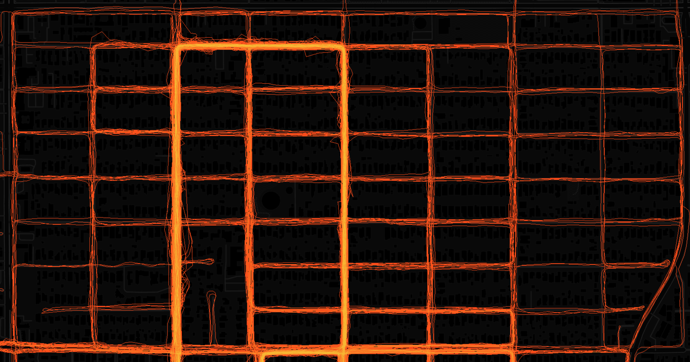

# flashover



A web application for visualizing your Strava activity routes with tile-based rendering and overlap-based gradient coloring.

### Quick Start (Docker)

The fastest way to get flashover running is with Docker.

#### Prerequisites

- [Docker](https://docs.docker.com/get-docker/) and [Docker Compose](https://docs.docker.com/compose/install/) installed
- Strava account with API credentials
  - Register your app at: https://www.strava.com/settings/api
  - Set **Authorization Callback Domain** to: `localhost`

#### Step 1: Clone and Configure

```bash
# Clone the repository
git clone <your-repo-url>
cd flashover

# Copy the example environment file
cp backend/.env.example backend/.env
```

Edit `backend/.env` and add your Strava API credentials:

```bash
# Required: Strava app credentials https://www.strava.com/settings/api 
STRAVA_CLIENT_ID=your_client_id_here
STRAVA_CLIENT_SECRET=your_client_secret_here

# These are pre-configured for Docker
STRAVA_REDIRECT_URI=http://localhost:8080/auth/strava/callback
FRONTEND_URL=http://localhost:8080
```

#### Step 2: Build and Run

```bash
# Build the Docker image and start the container
docker-compose up --build
```

This will start the application on port 8080.

#### Step 3: Use the Application

1. **Open your browser** to: http://localhost:8080

2. **Connect to Strava**
   - Click "Connect to Strava"
   - Authorize the application
   - You'll be redirected back to Flashover

3. **Sync your activities**
   - Click "Sync Activities" to fetch your route data
   - Initial sync takes ~10-30 seconds depending on activity count
   - Routes will render automatically on the map

4. **Explore your routes**
   - Pan and zoom to see your most-traveled paths
   - Brighter colors = more overlapping routes
   - Use filters to view specific activity types or date ranges

#### Managing the Docker Container

```bash
# Stop the application
docker-compose down

# Restart without rebuilding
docker-compose up

# Rebuild after code changes
docker-compose up --build

# View logs
docker-compose logs -f flashover

# Clean up everything (including database)
docker-compose down -v
rm -rf db/
```

### Development Tips

For local development with hot-reload:

**Backend:**
```bash
cd backend
python -m venv venv
source venv/bin/activate  # On Windows: venv\Scripts\activate
pip install -r requirements.txt
cp .env.example .env  # Configure your .env
python -m uvicorn app.main:app --reload --port 8080
```

**Frontend:**
```bash
cd frontend
npm install
npm run dev  # Runs on port 3000 with proxy to backend
```

## Usage

1. **Connect to Strava**: Click "Connect to Strava" and grant permissions
2. **Sync Activities**: Click "Sync Activities" to fetch your route data from Strava
3. **Explore Your Routes**:
   - Pan and zoom the map to explore your activities
   - Routes are rendered as tiles (cached for instant viewing)
   - Bright colors show frequently-traveled routes
4. **Apply Filters** (optional):
   - Select activity type (Run, Ride, Walk, etc.)
   - Choose date range
   - Routes update automatically

## Acknowledgements
 - [hotpot](github.com/erik/hotpot)
